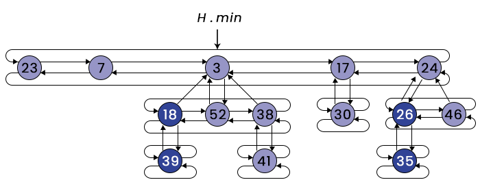

# fibonacci_heap
This repository contains my implementation of Fibonacci Heap data structure in Python, done as part of the Advanced Algorithms and Data Structures course at the Faculty of Electrical Engineering in Sarajevo. The implementation was modeled after the pseudocode found in the book "<a href="https://mitpress.mit.edu/9780262046305/introduction-to-algorithms/">Introduction to Algorithms</a> ".

# Fibonacci Heap
  
A Fibonacci Heap is a versatile data structure that provides efficient implementations of various priority queue operations such as insert, extract minimum, decrease key, and union. It is particularly useful in algorithms like Dijkstra's shortest path and Prim's minimum spanning tree.

# 📁 Project structure
The project is organized with the following directory structure:

```bash
Fibonacci_heap/
│
├── main.py
├── tests/
│   └── test.py
│
└── classes/
    ├── FibNode.py
    └── FibHeap.py
```

- main.py - main entry point, contains a simple example of a Fibonacci Heap.

- tests/ - holds unit tests for the project
  - test.py - contains 12 unit tests testing different scenarios 

- classes/ - contains the main classes required for implementation
  - FibNode.py - definition of the node structure used in the Fibonacci Heap
  - FibHeap.py - implementation of the Fibonacci Heap data structure

# 🔎 Implementation details

The Fibonacci Heap itself is represented by FibHeap class with following attributes:

- <strong>root_list</strong> - a pointer to one of the nodes in a doubly linked list of root nodes
- <strong>min</strong> - a pointer to the node with minimum key value
- <strong>n</strong> - number of nodes in the heap

Singular nodes are instances of class FibNode, representing a node of a Fibonacci Heap using the following attributes:

- <strong>key</strong> - key value of node
- <strong>parent</strong> - parent of node
- <strong>child</strong> - pointer to one of the nodes in a doubly linked list of child nodes
- <strong>left</strong> - left sibling of node
- <strong>right</strong> - right sibling of node
- <strong>degree</strong> - degree of node (number of node's children)
- <strong>marked</strong> - mark of node (True or False)
- <strong>id</strong> - unique id of node 

# Main Methods
- <strong>fib_heap_insert(key)</strong> - inserts new node with given key into heap
- <strong>fib_extract_min()</strong> - removes and returns node with minimum key
- <strong>fib_heap_decrease_key(key, new_key)</strong> - decreases key value of node with given key to new key value
- <strong>fib_heap_delete(key)</strong> - removes node with given key from heap
- <strong>fib_heap_union(h1, h2) - performs concatenation of two given heaps into a new heap


  
  
